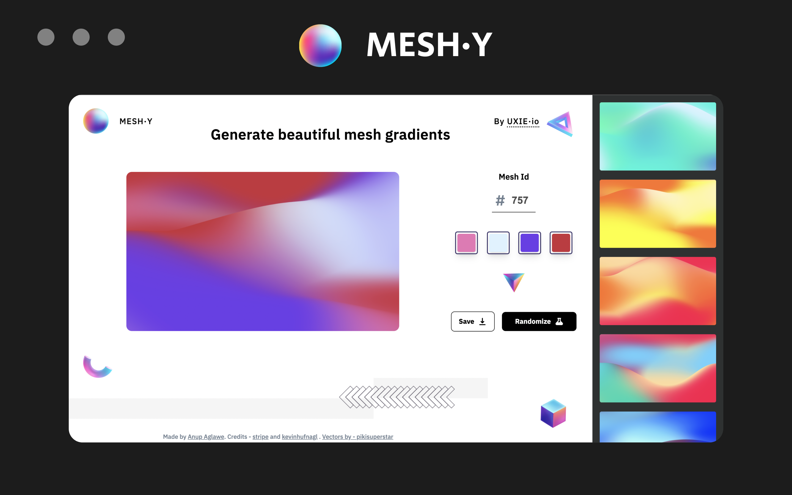

---

# Meshy

`Generate beautiful mesh gradients.`

Meshy is a design tool to generate beautiful & colorful mesh gradients. Generate multiple random variations of Mesh gradients along with cool color customizations.

> Built with Svelte + Vite + Sass

 

## Screenshot

 

## Export 

## Credits

- Stripe - `https://stripe.com`
- kevinhufnagl - `https://kevinhufnagl.com/` 
- Vectors by - [pikisuperstar](https://www.freepik.com/vectors/background)